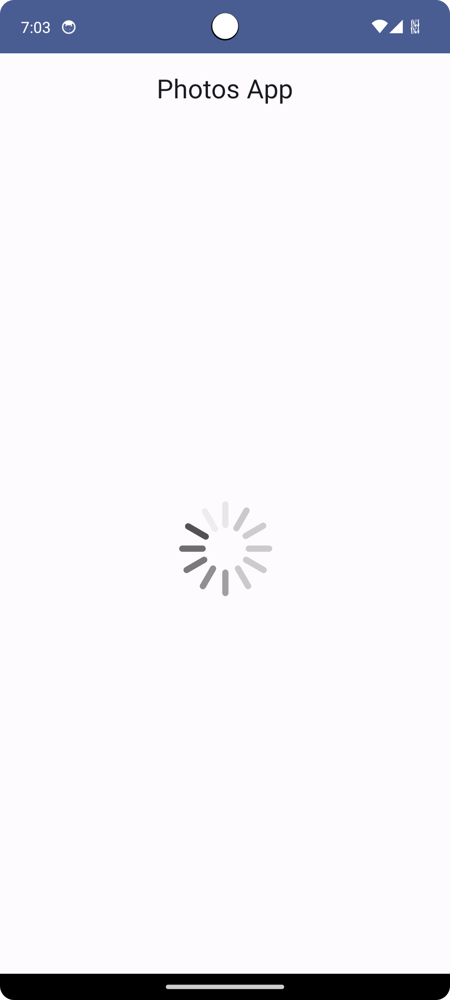
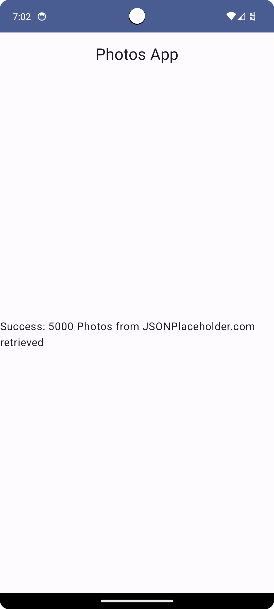
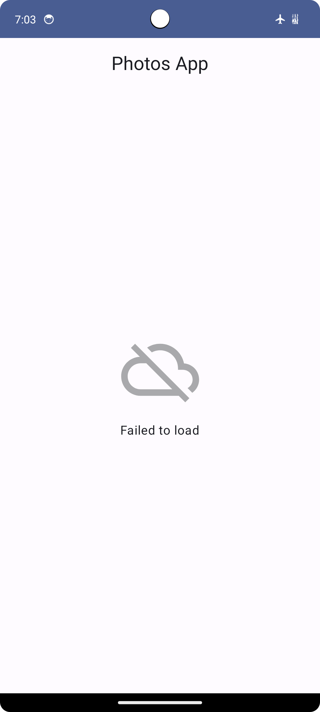

# Photos
Hai, perkenalkan saya Ika Nurfitriani! Repositori ini merupakan hasil latihan projek kelas dengan referensi berasal dari codelab. Hasil projek berupa projek aplikasi Android yang diberi nama Photos App. Aplikasi ini menampilkan kumpulan foto dari API jsonplaceholder.

# Fitur-Fitur
- LoadingScreen: Aplikasi menampilkan layar sedang memuat data atau loading.
- ResultScreen: Aplikasi menampilkan layar hasil yang menampilkan jumlah foto yang diambil dari API jsonplaceholder.
- ErrorScreen: Aplikasi menampilkan layar gagal memuat data.

# Screenshot Aplikasi
Berikut ini adalah hasil screenshot dari aplikasi Photos App:

   

## Author
[@Ika Nurfitriani](https://github.com/ikanurfitriani)